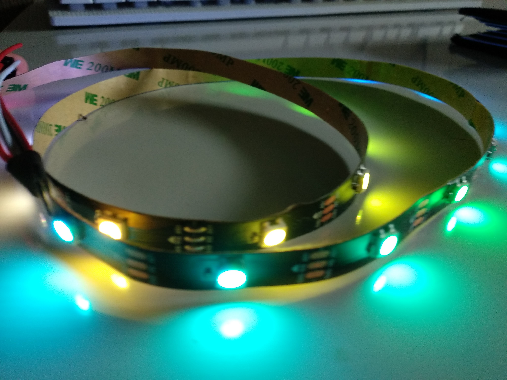
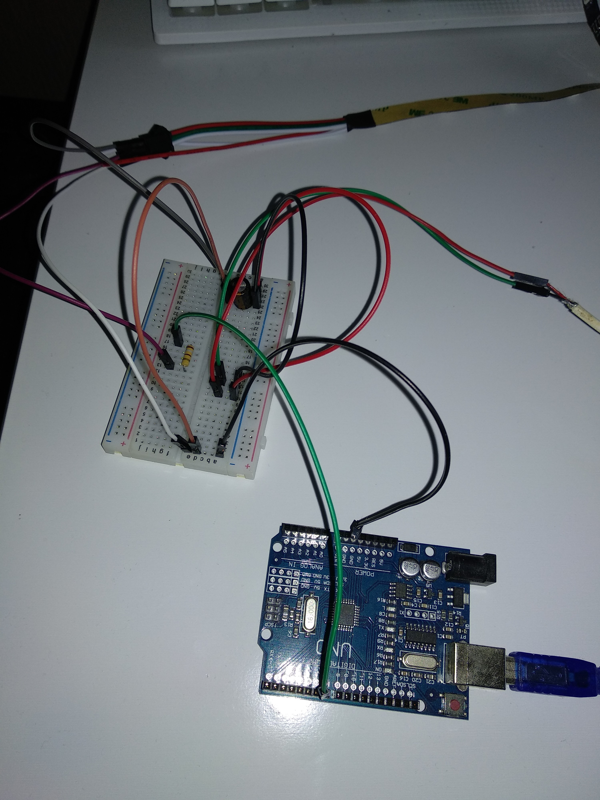

# ScreenColorImitator
Arduino powered LED strip that instantly imitates colors on screen.

In order to provide a pleasant light effect of tracking the colors on the screen in real time, it is required to have as little delay as possible. In this java application, the program must first take a screenshot of the screen, divide it into a number of parts, in this case 10. It then goes through each sector and calculates the average color of that sector over a pixel. To improve performance and reduce real-time imitation latency, multithreading is used. Thus, the program can simultaneously calculate the average color of one half of the screen while processing and calculating the other half of the screen.

Below you can see usage example for this project.

## Hardware

The Arduino actually serves as an intermediary that receives information from a Java application and forwards it to the LED strip, more precisely it sends the information to each microcontroller separately (on the LED strip). The main part of the project (apart from the code of course) is actually an addressable LED strip that serves for lighting. The LED strip is one meter long and consists of 30 LEDs. Each LED can be lit individually using small microcontrollers located on each LED, which can be seen in the image below.

The LED strip is powered via 5V and consists of 3 pins or wires, red represents plus (+), white minus (-) and green (DATA) which receives data from a source such as an Arduino microcontroller. The LED strips are normally powered via 12V, but this LED strip seems ideal because it can be connected directly to the Arduino Uno for a 5V power supply. However, it is not that simple. Each color on one diode needs 20mA to be able to work at the strongest light. The LED has 3 colors, red, blue and green. Which means one diode will take 60mA. 30 diodes x 60mA = 1800mA. The calculation shows that the entire LED strip will take 1800mA, ie 1.8A, in the highest possible light, which the Arduino Uno cannot handle. The Arduino Uno has an output of 400mA 5V. It is concluded that an external power supply is needed for the LED strip to work. The 9W power supply (5V x 1.8A = 9W) is a good choice. 

But that’s not the end of the story of merging the Arduino Uno and the LED strip. A capacitor with a capacity between 100uF and 1000uF has to be connected from the plus power supply to the minus Arduino to smooth the power supply. A 470 Ohm resistor also has to be added to reduce unwanted interference in the electrical signal (noise) on the line between the Arduino digital output pin and the green data input pin. Only after these steps LED strip be connected to the Arduino Uno via a digital pin and via GND. Image below shows the connected components.

## Software

The Adafruit_NeoPixel.h library was used for the Arduino Uno to send information to the LED strip. For Java, an RXTX library was used to send information over a serial protocol between a USB connection and an Arduino.

The Robot class was used to create “screenshots” via the createScreenCapture method with parameters of the intiger data type in which two variables representing pixels in length and width are entered. For example, Full HD has a resolution of 1920x1080, where 1920 is the number of pixels in width and 1080 is the number of pixels in length. Automatic reading of the screen resolution is achieved by the Dimensions class using the Toolkit.getDefaultToolkit () method. GetScreenSize (). Each section of the screen has the same value because the resolution width is divided by the number of sectors, in this case 10, is a Full HD screen. A Color data type field is defined where colors are stored for all 10 sections. The field is defined as public volatile which means it can be shared among threads.

In the for loop, you go from 0 to the number of sections through the counter, and in that loop, a specific section resolution is stored in the BufferedImage data type variable, eg section 1 = 0 to 192 pixels wide and 0-1080 pixels long, section 2 = from 192 to 384 pixels and 0-1080 pixels in length. These sections were obtained by the getSubimage method, which obtained the first coordinate in width by multiplying the width of the section and the counter. Then the average color of each sector must be obtained. This is obtained by going through two for loops through each sector and adding a certain color from 0 to 255 to each color initger. that the first pixel has red = 100, green = 50 and blue = 10, the second pixel has red = 75, green = 90 and blue = 0. The red intiger will have a value of 100 + 75 = 175 and will be divided by the number of times as many loops as there are (ultimately divided by the number of pixels per section). So we get the average color of the section.

It can be seen that the process is very complex since this algorithm is processed constantly in a loop loop which can lead to performance degradation. For this reason, an additional thread has been added in which one loop goes from 0 to half of the screen or the fifth section and calculates the average color of all five sections while the main thread goes from half the screen, the fifth section, all the way to the end. Only when both threads finish counting do the average colors of all sections save to a common field that is sent to the Arduino Uno.

